# A guided tour of the OpenGOAL Level Editor

This tour shows, picture by picture, how the editor works and why it works that way: from your
game disc to a level you built yourself, by hand or with an AI assistant. Every picture was made by
the editor itself (its `--screenshot` mode, see [the last part](#making-these-screenshots-again)),
with Jak II (PAL) and the interface in English.

1. [The approach](#the-approach)
2. [Extract your game](#1-extract-your-game)
3. [Open a level](#2-open-a-level)
4. [See it along the story](#3-see-it-along-the-story)
5. [Select and edit](#4-select-and-edit)
6. [Stretch, grow, shrink](#5-stretch-grow-shrink)
7. [The catalog](#6-the-catalog)
8. [Prefabs](#7-prefabs)
9. [Build a new level](#8-build-a-new-level)
10. [Let an assistant build it](#9-let-an-assistant-build-it)
11. [Save, and find help](#10-save-and-find-help)
12. [Making these screenshots again](#making-these-screenshots-again)

## The approach

The editor holds nothing of the games: it reads them from **your own copy**, turns them into
standard 3D files once, and edits those.

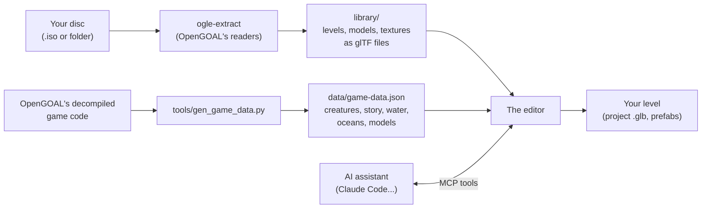

- **Extraction.** `ogle-extract` is made of the data readers of
  [OpenGOAL](https://github.com/open-goal/jak-project)'s decompiler. It reads the levels of your
  disc and writes each one as a [glTF](https://www.khronos.org/gltf/) file (`.glb`), the standard
  that Blender and most 3D tools open: its shell cut in pieces, its decor (one mesh per prototype,
  shared by all its copies), its collision and its actors (objects, with the data the game gives
  them). The models of the actors and the textures go next to it. This happens once.
- **Game data.** Some knowledge is not in the level files: which actors are creatures, which parts
  of a level appear or vanish as the story goes, which model an object draws, where the ocean is.
  `tools/gen_game_data.py` reads it from OpenGOAL's decompiled game code and writes
  `data/<game>/game-data.json`, which comes with the editor (it holds names and rules, no data of
  the game).
- **Editing.** A level opens as a scene of elements you can select, move, rotate, scale, copy and
  delete; every change can be undone. What you build is saved as a project: a `.glb` file too.
- **The catalog** gathers what can be put in a level: every object of the game, every other model
  and the decor of every level, found from the extracted files and the game data.
- **The assistant** drives the same editor through the Model Context Protocol (MCP): its tools are
  the editor's own actions (open, place, move, look, save), so everything it does can be seen and
  undone in the window.

## 1. Extract your game

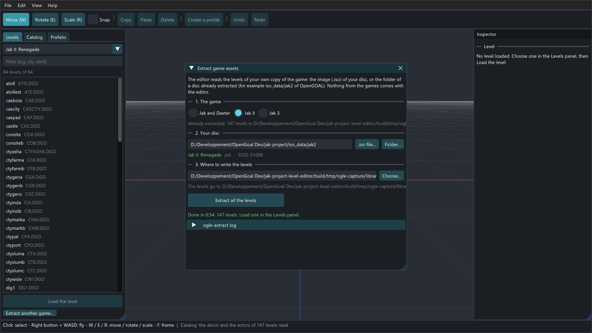

**File > Extract game assets** opens this window. Choose the game (1), point to your disc (2), an
`.iso` file or the folder of a disc already copied: the editor recognizes the game, its version and
its serial number (here Jak II, PAL, SCES-51608). Choose where the levels go (3), `library/` in the
editor's folder by default, and click **Extract all the levels**. For Jak II, the 147 levels of the
disc took 54 seconds.

## 2. Open a level

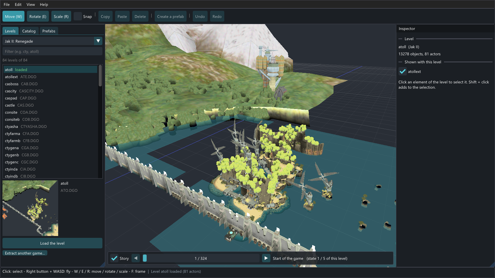

The window has three parts:

- on the left, the **Levels** panel: the levels of the game you extracted (the real levels only: the
  pieces the game loads for a mission or a cutscene are left out), a picture of the one chosen and
  **Load the level**;
- in the middle, the **3D view**: fly with the right mouse button and WASD (ZQSD on AZERTY), frame
  the level with Home;
- on the right, the **inspector**: what is loaded, or what is selected.

Here is Jak II's atoll: 13,278 elements and 81 actors, drawn with the colors of its lights, its
water and its ocean. Levels open **without their creatures** (enemies, characters, the Titan suit):
the editor is for places and objects. The level the game shows with this one (`atollext`) is shown
too, and can be hidden in the inspector.

## 3. See it along the story

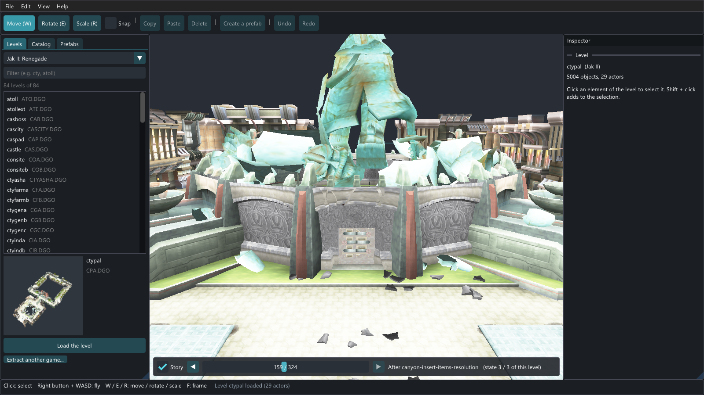

A level changes as the story goes: in Jak II, the statue of the palace square falls when Mar's tomb
opens. The **story bar**, at the bottom of the view, shows the level at a point of the game: move
along the 324 steps of the story, or jump with the arrows to the previous or next change of this
level. Here, just after `canyon-insert-items-resolution`: the broken statue and its rubble,
which the start of the game does not show. Uncheck **Story** to see every state of the level at
once.

The editor knows this from the game data: the missions in the order of the game, and what each one
shows or hides.

## 4. Select and edit

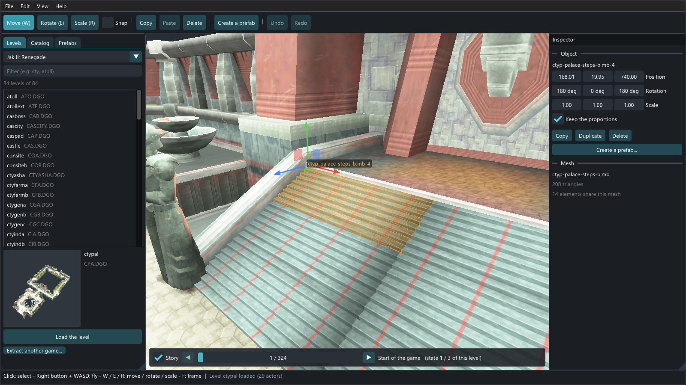

**Click** an element to select it: here a flight of steps of the palace (outlined in orange). Each
element is its own: these steps are one of 14 copies of the same mesh (the inspector says so), and
the click selected this one only. **Shift or Ctrl + click** adds to the selection, a **drag** in an
empty spot selects everything in a rectangle.

The **gizmo** moves the selection (**W**: drag an arrow or a square) or rotates it (**E**: drag a
ring); the inspector gives the exact position, rotation and scale. **Copy** (Ctrl+C), **Paste**
(Ctrl+V), **Duplicate** (Ctrl+D), **Delete** (Del), **Undo** (Ctrl+Z) and **Redo** (Ctrl+Y) do
what they say. The large pieces of ground are locked, so that clicks go to what stands on them.

## 5. Stretch, grow, shrink

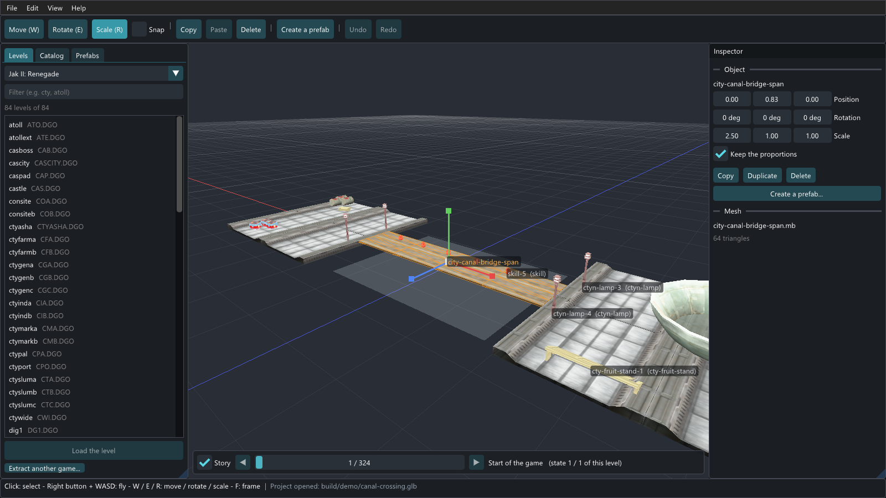

**Scale (R)** turns the gizmo into squares: drag the square at the end of an axis to stretch the
selection along it, or the square in the middle to make it bigger or smaller. The axes are the
element's own. Here a canal bridge of the city, 16 m long, stretched 2.5 times to span 40 m over a
pool; the inspector shows its scale (2.50, 1.00, 1.00). With **Keep the proportions** checked,
changing one value changes the three.

The game keeps the scale of decor (pieces, prototypes, models) but gives most of its objects their
own size, whatever the level says: the inspector warns when an object is scaled.

## 6. The catalog

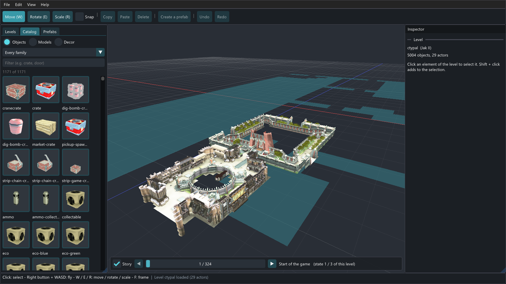

The **Catalog** panel lists what can be put in a level, placed like a prefab: click an element,
then click in the view (R turns it, Esc stops), or drag it into the view. It has three tabs.

**Objects** (1,171 for Jak II), by family and with a filter:

- the objects of the game: crates, collectables, platforms and elevators, doors, buttons, jump
  pads, hazards, lights, turrets, vehicles, the water, dark eco and lava of each level...;
- the particle effects of the levels (lights, neon signs, steam), and the logic that makes sense in
  another level.

A new object takes the data of an object of its type found in the game's levels (the pickup of a
crate...), without what ties that one to its level.

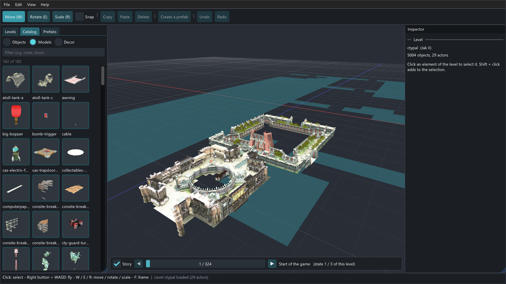

**Models** (182): every other model of the game but the characters, placed as decor: parts of
objects, debris, props.

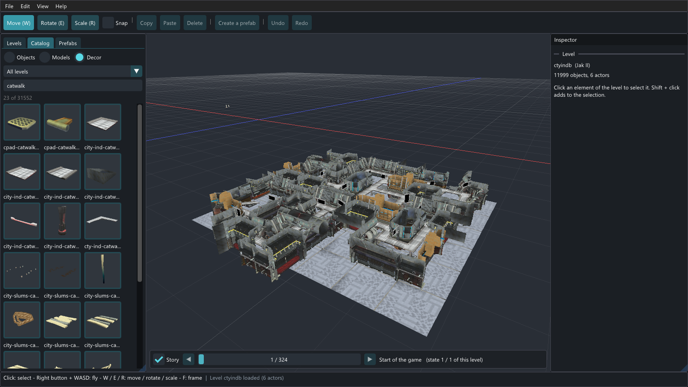

**Decor**: the decor of the levels, to reuse anywhere: their prototypes (a pillar, an arch, a lamp
post) and the pieces of their shell (a wall, a bridge). **All levels** searches the 31,552 parts of
Jak II's levels by name: `catwalk` finds the 23 catwalks of the industrial zone, the slums, the
drill platform and `caspad`. Choose a level instead to browse its whole decor.

The first time a library is shown, the editor reads what the catalog needs of every level in the
background (a few seconds) and keeps it: the next times, the catalog is complete at once.

## 7. Prefabs

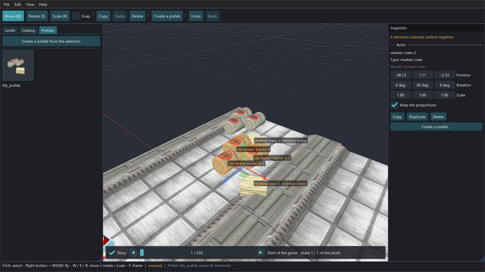

A prefab is a group of elements saved together, to place again anywhere. Select the elements (here
three barrels and a market crate), click **Create a prefab** and give it a name: it appears in the
**Prefabs** panel, with a picture. Click it, then click in the view to place copies: here a copy was
placed in front of the original group, and is selected. A prefab sits on the surface it is placed
on, and its objects get names of their own (`market-crate-2`), as the game needs.

## 8. Build a new level

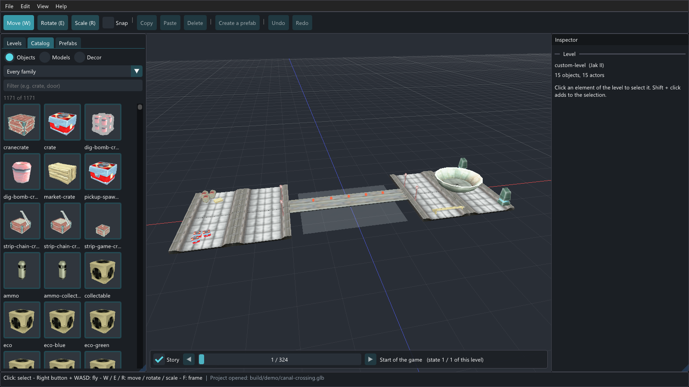

**File > New level** (Ctrl+N) starts an empty level of the game shown in the Levels panel. This one
was built only from the catalog: two decks made of eight catwalk modules of the industrial zone
(Decor), the palace's pool between them (Objects, Water), the canal bridge of the previous picture
stretched across it, lamps, orbs along the bridge, crates and barrels, the palace's fountain bowl
and a fruit stand of the market. There is no ground at first: an element placed in the void goes to
height 0, and later ones can be dropped onto the surfaces below.

## 9. Let an assistant build it

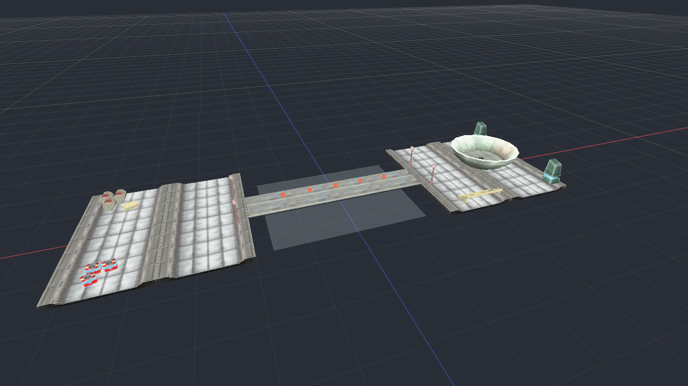

The level of the previous picture was not built by hand: a script built it through the editor's
remote control, with the very tools the MCP server gives an assistant such as Claude Code. That is
what an assistant does when you ask it for *"a small crossing: two decks of the industrial zone and
a bridge over the palace's pool"*: it looks for parts, places them, and checks its work with a
picture of the view (above: what `capture_view` returns). The calls look like this:

```json
{"tool": "new_level",       "args": {}}
{"tool": "list_decor",      "args": {"filter": "catwalk"}}
{"tool": "place",           "args": {"kind": "decor", "name": "city-ind-catwalk-main-01", "position": [-44, 0, -8]}}
{"tool": "place",           "args": {"kind": "object", "name": "water-anim-ctypal-lrgsqr-pool", "position": [0, -1.5, 0]}}
{"tool": "place",           "args": {"kind": "decor", "name": "city-canal-bridge-span", "position": [0, 0.83, 0]}}
{"tool": "transform_nodes", "args": {"ids": [11], "scale_by": [2.5, 1, 1]}}
{"tool": "place",           "args": {"kind": "object", "name": "ctyn-lamp", "position": [-22, 10, 5], "on_ground": true}}
{"tool": "capture_view",    "args": {"width": 1280, "height": 720}}
{"tool": "save_project",    "args": {"path": "build/demo/canal-crossing.glb"}}
```

With an assistant, every call happens in the editor window you see, and can be undone. The whole
sequence is in [`tools/build_demo_level.py`](../../tools/build_demo_level.py), which builds this
level again (`python tools/build_demo_level.py`); how to connect Claude Code is in
[the README](../../README.md#5-building-levels-with-an-assistant-mcp).

## 10. Save, and find help

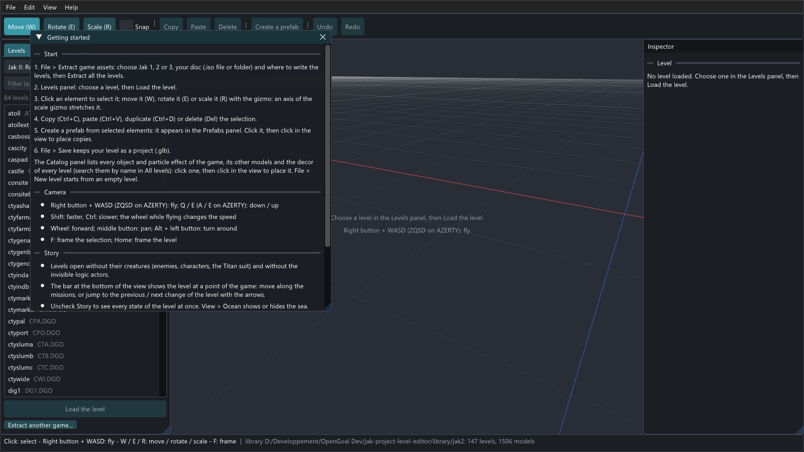

**File > Save** (Ctrl+S) writes your level as a project, a `.glb` file (Blender opens it too), with
backups next to it; **File > Open project** (Ctrl+O) opens it again. **Help > Getting started**
(F1) sums up this tour: the steps, the camera, the story and the editing shortcuts.

## Making these screenshots again

The editor makes these pictures itself, in a hidden window. From the repository root, after
building the editor and extracting Jak II (add `--library <folder>` when your levels are not in
`library/`):

```bash
E=build/bin/open-goal-level-editor
$E --screenshot "<your Jak II disc: .iso or folder>" docs/captures/02-extraction.png extract --lang en
$E --screenshot atoll docs/captures/01-overview.png levels --lang en
$E --screenshot ctypal docs/captures/05-story.png levels --lang en \
   --camera 192,45,845,180,-14 --story canyon-insert-items-resolution
$E --screenshot ctypal docs/captures/03-selection.png select --lang en
$E --screenshot ctypal docs/captures/06-catalog.png catalog --lang en
$E --screenshot ctypal docs/captures/09-models.png models --lang en
$E --screenshot ctyindb docs/captures/08-decor-search.png decor-all --lang en
$E --screenshot atoll docs/captures/12-help.png help --lang en

# the demo level, built through the remote control, and the assistant's view of it
python tools/build_demo_level.py --view docs/captures/11-assistant-view.png
D=build/demo/canal-crossing.glb
$E --screenshot $D docs/captures/07-scale.png scale --lang en
$E --screenshot $D docs/captures/04-prefabs.png prefab --lang en \
   --select cty-tanker-barrel,cty-tanker-barrel-2,cty-tanker-barrel-3,market-crate-1
$E --screenshot $D docs/captures/10-new-level.png project --lang en --camera -18,52,84,-12.1,-31.2
```

The setups (the word after the file name):

| Setup | What the picture shows |
|---|---|
| `levels` | the level given loaded, the Levels panel |
| `select` | the level given, one of its decor elements selected (near the middle of the level), the gizmo on it |
| `scale` | the element stretched, the scale gizmo: a catwalk of the level given, or the first stretched element of a project |
| `prefab` | a prefab made of a few elements and a copy placed next to them, the Prefabs panel |
| `catalog`, `models` | the level given loaded, the objects or the models of the Catalog panel |
| `decor`, `decor-all` | the decor of the level given in the Catalog panel, or the decor of every level searched for `catwalk` |
| `project` | a project (`.glb`) opened, the objects of the Catalog panel |
| `extract` | the extraction window, extracting the disc given to a temporary folder deleted afterwards |
| `help` | the Getting started window |

The options: `--size WxH` (1600x900 by default), `--camera x,y,z,yaw,pitch` (position in meters,
angles in degrees), `--story off|<step>|<node>` (the point of the story shown) and
`--select a,b,...` (the elements `select`, `scale` and `prefab` use, by name). A capture never
changes the editor's preferences, and the prefab of `prefab` is written to a temporary folder.

The screenshots show levels of Jak II extracted from a copy of the game. The game belongs to Sony
Interactive Entertainment and was developed by Naughty Dog; the editor is built on the work of the
OpenGOAL team, with which it is not affiliated (see [`LICENSE`](../../LICENSE)).
